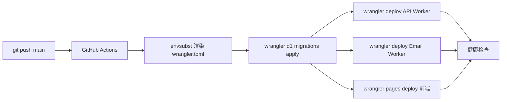

# PMail CI/CD 部署文档

本文档描述 PMail 通过 GitHub Actions 自动化部署到 Cloudflare 的完整流程，覆盖首次资源准备、Secrets 配置、日常运维和排错。

---

## 1. 概述

PMail 由三个 Cloudflare 组件组成，全部通过 GitHub Actions 自动部署：

- **API Worker**（`pmail-api`）：处理前端 HTTP 请求
- **Email Worker**（`pmail-receiver`）：接收入站邮件
- **Pages 前端**（`pmail-web`）：Vue/React 静态站点

### 部署架构



核心设计：

- `wrangler.toml` 在仓库内只保留 `wrangler.toml.example` 模板，所有资源 ID 通过 `envsubst` 在 CI 中从 GitHub Secrets 注入，**绝不进仓库**。
- 仅维护 **production** 单一环境，预览环境后续按需扩展。
- D1 migration 使用 wrangler 原生子命令 `wrangler d1 migrations apply`，无需引入额外工具。
- 前端构建产物通过 `wrangler pages deploy` 上传，不依赖 Cloudflare Pages 的 Git 集成。

### 人工干预点

整套流程仅在以下三个时刻需要人工操作，之后即可全自动：

1. **首次 Cloudflare 资源创建**（D1、R2、KV、Queue、Pages 项目、API Token）。
2. **GitHub Secrets 配置**（一次性录入 20 余个 Secret）。
3. **Email Routing 路由绑定**（Worker 首次部署成功后，在 Dashboard 把 catch-all 路由指向 `pmail-receiver`）。

---

## 2. 首次部署前的一次性 Cloudflare 资源准备

所有命令均在本地终端执行，需先安装 `wrangler`（`npm i -g wrangler`）。建议执行过程中**用一个文本文件记录所有返回的 ID**，后面要逐个填入 GitHub Secrets。

### 2.0 快速方式：使用 bootstrap 脚本（推荐）

仓库内提供了一键脚本 `scripts/bootstrap.mjs`（Node 18+），可在一次执行内完成 §2.2 – §2.4 的全部资源创建（D1 / R2 / KV），自动检测已存在的资源并**幂等复用**，最后渲染本地 `wrangler.toml` 系列文件以及 `.env`，便于把每个资源 ID 直接拷贝到 GitHub Secrets。

前置条件：已运行过 `wrangler login`，或导出了 `CLOUDFLARE_API_TOKEN`；若账号下有多个 account，需通过 `--account-id` 或 `CLOUDFLARE_ACCOUNT_ID` 指明。

```bash
# 试运行：仅打印计划，不创建任何资源
node scripts/bootstrap.mjs --dry-run

# 正式执行
node scripts/bootstrap.mjs

# 资源名后缀（避免与他人共享 account 时撞名）
node scripts/bootstrap.mjs --name-suffix=stg
```

脚本完成后，在控制台输出的 `Plan` 表格里能看到每个资源的 ID/名称，按 §3 表格映射到对应 GitHub Secret 即可。

> 这是**一次性操作**。如果偏好完全手动控制、或想了解每一步具体在做什么，可跳过本节、按下面 §2.1 – §2.6 顺序逐条执行。

### 2.1 登录 Cloudflare

```bash
wrangler login
```

浏览器会弹出授权页面，授权完成后本机会写入凭证。

### 2.2 创建 D1 数据库

```bash
wrangler d1 create pmail-db
```

输出形如 `database_id = "xxxxxxxx-xxxx-..."`，记录为 `D1_DATABASE_ID`。数据库名 `pmail-db` 记录为 `D1_DATABASE_NAME`。

### 2.3 创建 R2 存储桶

```bash
wrangler r2 bucket create pmail-storage
```

桶名对应 `R2_BUCKET`。**附件与数据库备份共用同一个桶**，通过 key 前缀区分：附件存到 `attachments/` 前缀，自动备份存到 `backups/` 前缀。

### 2.4 创建 2 个 KV 命名空间

每条命令都会返回一个 `id`，逐个记录：

```bash
wrangler kv:namespace create JWT_KEYS           # -> KV_JWT_KEYS_ID
wrangler kv:namespace create CACHE              # -> KV_CACHE_ID
```

命名空间用途：

| 命名空间 | 用途 |
|---|---|
| `JWT_KEYS` | 版本化 JWT 签名密钥（轮换） |
| `CACHE` | 共享缓存，按 key 前缀复用：`reset:*`（密码重置）/ `oauth:*`（OAuth state CSRF）/ `email_valid:*`（地址有效性缓存）/ `settings:*`（系统配置） |

### 2.5 创建 Pages 项目

```bash
wrangler pages project create pmail-web --production-branch=main
```

项目名记录为 `PAGES_PROJECT_NAME`。

### 2.6 创建 Cloudflare API Token

在 Dashboard → **My Profile → API Tokens → Create Token → Custom token** 创建，授予以下最小权限：

| Scope | Permission |
|---|---|
| Account → Workers Scripts | Edit |
| Account → D1 | Edit |
| Account → Workers R2 Storage | Edit |
| Account → Workers KV Storage | Edit |
| Account → Cloudflare Pages | Edit |
| Account → Email Routing Addresses | Read |

复制生成的 token 作为 `CLOUDFLARE_API_TOKEN`。Account ID 在 Dashboard 右侧栏可见，记录为 `CLOUDFLARE_ACCOUNT_ID`。

### 2.7 配置 Email Routing（必须在 Worker 首次部署后）

Dashboard → **Email → Email Routing → Email Workers → Create route**：

- Matcher：`Catch-all`（或 `*@yourdomain.com`）
- Action：`Send to Worker → pmail-receiver`

此步必须等 `pmail-receiver` Worker 第一次部署成功后才能配置，否则下拉框选不到。

---

## 3. GitHub Secrets 完整配置表

仓库 → **Settings → Secrets and variables → Actions → New repository secret**。Secret 名称必须与下表完全一致（已与 workflow 和 `wrangler.toml.example` 模板约定）。

### 3.1 Cloudflare 凭证

| Secret | 说明 | 来源 |
|---|---|---|
| `CLOUDFLARE_API_TOKEN` | Wrangler 部署用 API Token | §2.7 |
| `CLOUDFLARE_ACCOUNT_ID` | Cloudflare Account ID | Dashboard 右侧栏 |

### 3.2 资源 ID / 名称（envsubst 注入到 wrangler.toml）

| Secret | 说明 | 来源 |
|---|---|---|
| `D1_DATABASE_ID` | D1 数据库 ID | §2.2 输出 |
| `D1_DATABASE_NAME` | D1 数据库名（`pmail-db`） | §2.2 |
| `R2_BUCKET` | R2 单桶名（`pmail-storage`，附件 + 备份共用） | §2.3 |
| `KV_JWT_KEYS_ID` | JWT_KEYS 命名空间 ID | §2.4 |
| `KV_CACHE_ID` | CACHE 命名空间 ID | §2.4 |
| `DOMAIN` | 业务主域名（如 `mail.example.com`） | 自定义 |
| `ALLOWED_ORIGINS` | CORS 白名单，逗号分隔 | 自定义 |
| `OAUTH_LINUXDO_CLIENT_ID` | Linux.do OAuth 应用 Client ID（非机密，但通过 envsubst 注入到 `wrangler.toml` 的 `[vars]` 段） | Linux.do OAuth 应用注册页 |

### 3.3 Worker 运行时 Secrets

| Secret | 说明 | 如何生成 |
|---|---|---|
| `DATABASE_ENCRYPTION_KEY` | D1 字段级加密密钥（32 字节 hex） | `openssl rand -hex 32` |
| `TURNSTILE_SECRET_KEY` | Cloudflare Turnstile 验证密钥 | Turnstile Dashboard |
| `OAUTH_LINUXDO_CLIENT_SECRET` | LinuxDo OAuth Client Secret | LinuxDo 应用后台 |
| `SENDGRID_API_KEY` | SendGrid 出站发信（可选） | SendGrid Dashboard |

> **DATABASE_ENCRYPTION_KEY 一经设定不可变更**，更换会导致历史加密数据全部无法解密。

### 3.4 前端构建变量（Vite 编译期注入）

| Secret | 说明 |
|---|---|
| `VITE_API_BASE_URL` | API Worker 公开地址，如 `https://api.mail.example.com` |
| `VITE_TURNSTILE_SITE_KEY` | Turnstile Site Key（前端可见） |

### 3.5 Pages 与健康检查

| Secret | 说明 |
|---|---|
| `PAGES_PROJECT_NAME` | Pages 项目名（`pmail-web`） |
| `API_URL` | 部署后健康检查的 URL，如 `https://api.mail.example.com/health` |

---

## 4. 首次部署 checklist

1. 完成 §2 全部 Cloudflare 资源准备，并保存所有 ID。
2. 按 §3 在 GitHub 仓库录入全部 Secrets，**逐项核对名称拼写**。
3. 本地确认 `wrangler.toml.example`、`migrations/`、`.github/workflows/deploy.yml` 已提交。
4. `git push origin main`，触发 workflow。
5. 打开仓库 **Actions** 页面，按 job 顺序观察日志：
   - `render-config`：envsubst 输出后 grep 不到 `${`
   - `migrate`：`wrangler d1 migrations apply pmail-db --remote` 成功
   - `deploy-api` / `deploy-email` / `deploy-pages`：三个 deploy 全绿
   - `healthcheck`：`API_URL` 返回 200
6. 回到 Cloudflare Dashboard 按 §2.7 绑定 Email Routing.
7. 浏览器访问前端，跑一遍：注册 → 收到验证邮件 → 登录 → 查看收件箱核心流程。

---

## 5. 日常运维

### 5.1 查看与回滚 Worker

Dashboard → **Workers & Pages → 选 Worker → Deployments**，每次部署都会生成一个版本，点击历史版本右侧 **Rollback** 即可。

### 5.2 回滚 Pages

Dashboard → **Workers & Pages → pmail-web → Deployments**，选目标版本 → **Rollback to this deployment**。

### 5.3 D1 migration 回滚

D1 migration **不可逆**。如需回滚，必须在 `workers/api/migrations/` 新增一个反向 migration（例如 `0002_revert_xxx.sql`），通过新一次部署执行。**严禁手动改动已发布的 migration 文件**。详见 §8。

### 5.4 手动触发部署

GitHub → **Actions → 选 `deploy` workflow → Run workflow → 选 main 分支**。适用于：

- 修改了 GitHub Secret 后想立刻生效
- 上一次部署因瞬时错误失败，需重试

### 5.5 仅更新 Secret 不改代码

两种方式择一：

- **Worker 运行时 Secret**（如 `TURNSTILE_SECRET_KEY`）：可本地直接 `wrangler secret put TURNSTILE_SECRET_KEY --name pmail-api` 推送，无需走 CI。
- **CI 注入型 Secret**（如 `ALLOWED_ORIGINS`、资源 ID）：在 GitHub Secrets 改完后，按 §5.4 手动触发 workflow 重新渲染并部署。

---

## 6. 排错指南

| 现象 | 原因 | 处理 |
|---|---|---|
| envsubst 渲染后日志里仍有 `${XXX}` 残留 | 对应 GitHub Secret 未配置或名称拼错 | 检查 §3 表格，补齐 Secret 后重跑 |
| `wrangler d1 migrations apply` 报 `Authentication error` | `CLOUDFLARE_API_TOKEN` 缺 D1:Edit 权限 | 回到 §2.7 重建 Token |
| `wrangler deploy` 报 `binding xxx not found` 或 `invalid id` | 对应资源未创建，或 Secret 里的 ID 写错 | 用 `wrangler d1 list` / `kv:namespace list` 比对 |
| Pages 部署成功但浏览器打不开 | DNS 未解析 / CSP 阻断 / `VITE_API_BASE_URL` 指向错误 | 检查自定义域 DNS、浏览器 console、重新构建前端 |
| Email Worker 部署成功但收不到邮件 | 未在 Dashboard 配置 Email Routing 路由 | 按 §2.7 绑定 catch-all → `pmail-receiver` |

排错通用思路：先看 GitHub Actions 日志定位失败 step，再到 Cloudflare Dashboard → Workers → Logs（实时日志）观察 Worker 运行时报错。

---

## 7. 安全注意事项

- **最小权限原则**：`CLOUDFLARE_API_TOKEN` 严格按 §2.6 列表授权，不要图省事用 Global API Key。
- **DATABASE_ENCRYPTION_KEY 一次性**：首次部署前用 `openssl rand -hex 32` 生成并妥善备份（如团队密码管理器）。设置后**永远不要更换**，否则历史加密数据全部失效。
- **日志脱敏**：workflow 中绝不要 `echo $SECRET_NAME`，GitHub 虽对已知 Secret 做星号掩码，但拼接、Base64 编码或截断后的输出可能绕过掩码。
- **Secrets 范围隔离**：仅在仓库级配置生产 Secrets，不要放到 Environment 之外的 Variable 里（Variable 不脱敏）。
- **OIDC 优化方向**：当前用静态 `CLOUDFLARE_API_TOKEN`。后续可切换到 Cloudflare 支持的 OIDC 短期凭证流，消除长期 Token 泄漏风险。
- **依赖审计**：建议为 workflow 增加 `npm audit --production` 和 Dependabot，避免供应链污染。

---

## 8. 数据库 schema 演进策略

PMail 遵循 `CLAUDE.md` 中"无历史兼容性负担"原则运作 —— 项目尚未正式上线，**没有需要保护的存量用户数据**。基于这一前提，migration 体系被简化为**单一 baseline 模式**。

### 8.1 真相源（Source of Truth）

- `schema.sql`：用于本地一次性初始化数据库的完整 DDL，是 schema 的人类可读版本。
- `workers/api/migrations/0001_init.sql`：CI 部署链路实际执行的 baseline migration，由 `wrangler d1 migrations apply` 跑。

**两份文件必须保持一致**。任何一处修改，另一处同步更新；提交前在本地用空库分别执行两份脚本，确认建表结果等价。

### 8.2 修改 schema 的两种场景

**场景 A：未上线 / 可重置数据库（默认）**

直接编辑 `0001_init.sql` 和 `schema.sql`，重新执行 baseline 即可。本地：

```bash
wrangler d1 execute pmail-db --local --file=./schema.sql
```

远端（破坏性，会清空数据）：先在 Dashboard 删除 D1 数据库再用 §2.2 / bootstrap 重建，然后 CI 自动重跑 `0001_init.sql`。

**场景 B：已部署到生产 / 数据需保留**

不再编辑 `0001_init.sql`，而是新增 `0002_xxx.sql`、`0003_xxx.sql` 等增量 migration。CI workflow 中的 `wrangler d1 migrations apply pmail-db --remote` 是**幂等**的 —— 它通过 D1 内置的 `d1_migrations` 表跟踪已应用的版本，只执行新增的文件，已应用的不会重复跑。

切换到场景 B 后，0001_init.sql 即被视为不可变历史，按 §5.3 严格禁止追改。

### 8.3 D1 ALTER TABLE 限制

SQLite（D1）对 ALTER TABLE 支持很有限，写新 migration 时注意：

- 不支持 `ADD COLUMN IF NOT EXISTS`，重复执行会报错；需依赖 migration 框架的幂等性而非 SQL 本身的幂等。
- 不支持 `DROP COLUMN`（旧 SQLite 版本）、`ALTER COLUMN TYPE`、修改约束。这些场景需 `CREATE TABLE _new → INSERT SELECT → DROP old → ALTER RENAME` 四步法。
- `CREATE INDEX IF NOT EXISTS` 是支持的，索引相关变更优先使用此形式。

### 8.4 与 CI 的协作

`.github/workflows/deploy.yml` 在每次部署时都会先跑 `wrangler d1 migrations apply`。这意味着：

- 新增 `0002_*.sql` 后只需 `git push`，无需任何手动 D1 操作。
- 若某次 migration 半途失败，D1 会记录已成功的部分；修复后再次部署，框架从断点继续而非重头跑。
- 本地开发时记得用 `wrangler d1 migrations apply pmail-db --local` 同步本地数据库，保持与生产 schema 一致。
