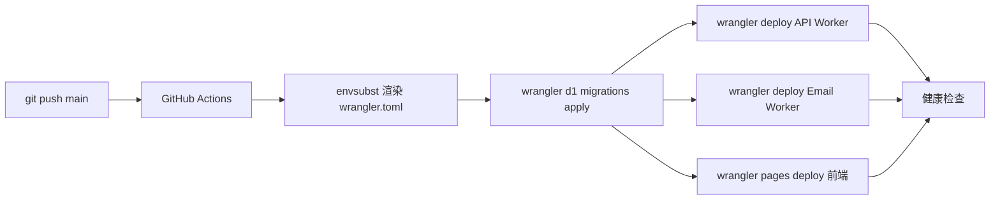

# PMail 部署指南

本文档面向想把 PMail 部署到自己 Cloudflare 账号的开发者，介绍部署流程：使用 `scripts/bootstrap.mjs` 一次性创建 Cloudflare 资源并写入配置，部署通过 GitHub Actions 自动执行（`git push main` 触发）。文档同时覆盖日常运维、备份恢复、卸载与排错。

PMail 由三个 Cloudflare 组件组成：

- **API Worker**（`pmail-api`）：处理前端 HTTP 请求
- **Email Worker**（`pmail-receiver`）：接收入站邮件
- **Pages 前端**（`pmail-web`）：React/Vite 静态站点

核心设计：

- `wrangler.toml` 只在仓库中保留 `wrangler.toml.example` 模板，所有资源 ID 通过 `envsubst` 注入（CI）或 `scripts/bootstrap.mjs` 渲染（本地），**绝不进仓库**。
- 仅维护 **production** 单一环境，预览环境按需扩展。
- D1 migration 使用 wrangler 原生 `wrangler d1 migrations apply`，无需引入额外工具。
- 前端通过 `wrangler pages deploy` 上传，不依赖 Pages 的 Git 集成。

整套流程仅在以下两个时刻需要人工：

1. **首次 Cloudflare 资源创建**（D1 / R2 / KV / Pages / API Token）
2. **Secrets 配置**（Worker secrets 与可选的 GitHub Secrets）

---

## 1. 前置条件

| 项 | 要求 | 验证命令 |
|---|---|---|
| Cloudflare 账号 | 免费即可 | — |
| 一个域名 | **已添加到 Cloudflare 托管 DNS**（Email Routing 必须） | Dashboard → 看是否有 Active 状态的 zone |
| Node.js | ≥ 18 | `node -v` |
| npm | 任意现代版本 | `npm -v` |
| wrangler | ≥ 4 | `npx wrangler --version` |
| curl | 任意 | `curl --version` |
| openssl | 任意 | `openssl version` |

可选项（开了对应功能才需要）：

- **Cloudflare Turnstile 站点** —— 注册/登录人机验证，免费在 Dashboard 申请
- **SendGrid 账号** —— 用于出站发信（密码重置邮件等）

> wrangler 不需要全局安装，仓库内 `workers/api/node_modules/.bin/wrangler` 就够用，`scripts/bootstrap.mjs` 会自动找。

---

## 2. Cloudflare 资源准备

所有命令均在本地终端执行。建议执行过程中**用一个文本文件记录所有返回的 ID**，CI 部署时还要逐个填入 GitHub Secrets。

### 2.1 自动方式：bootstrap.mjs（推荐）

仓库内提供了一键脚本 `scripts/bootstrap.mjs`（Node 18+），一次执行内完成 D1 / R2 / KV / Pages 资源创建，自动检测已存在的资源并**幂等复用**，渲染本地 `wrangler.toml` 系列文件以及 `.env`，并自动生成 + 推送 `JWT_SECRET`（已存在则跳过）。

前置条件：已运行过 `wrangler login`，或导出了 `CLOUDFLARE_API_TOKEN`；若账号下有多个 account，需通过 `--account-id` 或 `CLOUDFLARE_ACCOUNT_ID` 指明。

```bash
cd /path/to/PMail

# 一次性登录（浏览器授权，凭证写入 ~/.config/.wrangler/config/default.toml）
wrangler login

# 试运行：只打印计划，不创建任何东西
node scripts/bootstrap.mjs --dry-run

# 正式执行
node scripts/bootstrap.mjs
```

脚本会做这些事（**幂等**，已存在的资源会复用而不是重建）：

| 资源 | 名字 | 用途 |
|---|---|---|
| D1 数据库 | `pmail-db` | 用户、邮箱、邮件、附件元数据 |
| R2 桶 | `pmail-storage` | 附件（`attachments/` 前缀）+ DB 备份（`backups/` 前缀） |
| KV 命名空间 | `CACHE` | 共享缓存：`reset:*` / `email_valid:*` / `settings:*` |
| Pages 项目 | `pmail-web` | 前端静态站点 |

完成后还会自动渲染：

- `workers/api/wrangler.toml`
- `workers/email/wrangler.toml`
- `.env`（如果不存在则创建）

控制台输出的 `Plan` 表格里能看到每个资源的 ID/名称，CI 部署时按 [§3.2](#32-github-secrets仅-ci-部署需要) 表格映射到对应 GitHub Secret 即可。

#### 多账号或资源重名

```bash
# 账号下有多个 account：显式指定
node scripts/bootstrap.mjs --account-id=<your-account-id>

# 资源名被全局占用（特别是 Pages 项目名全局唯一）：加后缀
node scripts/bootstrap.mjs --name-suffix=mycorp
# → 资源名变成 pmail-db-mycorp、pmail-storage-mycorp、pmail-web-mycorp
```

> 这是**一次性操作**。如果偏好完全手动控制、或想了解每一步具体在做什么，可跳过本节、按下面 [§2.2](#22-手动方式逐条-wrangler-命令) 顺序逐条执行。

### 2.2 手动方式：逐条 wrangler 命令

按以下命令逐条执行，把返回的 ID 自己填进 `wrangler.toml`：

```bash
# 登录（如未登录）
wrangler login

# 1. D1 数据库
wrangler d1 create pmail-db
# 输出形如 database_id = "xxxxxxxx-xxxx-..."，记录为 D1_DATABASE_ID
# 数据库名 pmail-db 记录为 D1_DATABASE_NAME

# 2. R2 存储桶（附件与数据库备份共用一个桶，通过 key 前缀区分）
wrangler r2 bucket create pmail-storage
# 桶名对应 R2_BUCKET

# 3. KV 命名空间（返回一个 id，记录下来）
wrangler kv namespace create CACHE              # → KV_CACHE_ID

# 4. Pages 项目
wrangler pages project create pmail-web --production-branch=main
# 项目名记录为 PAGES_PROJECT_NAME
```

KV 命名空间用途：

| 命名空间 | 用途 |
|---|---|
| `CACHE` | 共享缓存：`reset:*`（密码重置）/ `email_valid:*`（地址有效性缓存）/ `settings:*`（系统配置） |

### 2.3 创建 Cloudflare API Token（CI 用）

在 Dashboard → **My Profile → API Tokens → Create Token → Custom token** 创建，授予以下最小权限：

| Scope | Permission |
|---|---|
| Account → Workers Scripts | Edit |
| Account → D1 | Edit |
| Account → Workers R2 Storage | Edit |
| Account → Workers KV Storage | Edit |
| Account → Cloudflare Pages | Edit |
| Account → Email Routing Addresses | Edit |
| Zone → Email Routing | Edit |

复制生成的 token 作为 `CLOUDFLARE_API_TOKEN`。Account ID 在 Dashboard 右侧栏可见，记录为 `CLOUDFLARE_ACCOUNT_ID`。

若是 CI 或无浏览器环境，也可直接导出该 token 代替 `wrangler login`：

```bash
export CLOUDFLARE_API_TOKEN=<your-token>
```

---

## 3. Secrets 配置

PMail 的敏感信息分两层：

- **Worker secrets**：通过 `wrangler secret put` 推送到 Cloudflare，运行时由 Worker 读取。`JWT_SECRET` 由 `bootstrap.mjs` 自动推送；其它（Turnstile 等）需要首次部署前手工跑一次 `wrangler secret put`
- **GitHub Secrets**：仅当走 GitHub Actions 自动部署时录入，CI 用 `envsubst` 渲染 `wrangler.toml` 并镜像推送 Worker secrets

### 3.1 Worker secrets

业务变量明文存在 `wrangler.toml` 里就行，但**敏感凭据**必须通过 `wrangler secret put` 推送，不要写文件。

> **`JWT_SECRET` 由 `scripts/bootstrap.mjs` 自动生成并推送**（用 `crypto.randomBytes(32)` 生成 base64 串），首次跑 bootstrap 后会自动出现在 `wrangler secret list` 里，无需手动设置。重跑 bootstrap 会检测已存在的 `JWT_SECRET` 并跳过，不会覆盖。如确需手动轮换，参考下方手动设置流程。

#### 必须设置（1 个）

```bash
# 进入 API Worker 目录
cd workers/api

# Turnstile 后端验证密钥
wrangler secret put TURNSTILE_SECRET_KEY
# 粘贴 Turnstile 控制台的 Secret Key 后回车

cd ../..
```

#### 手动设置 JWT_SECRET（仅在需要轮换或 bootstrap 未执行时）

```bash
cd workers/api
openssl rand -base64 32 | wrangler secret put JWT_SECRET
# 注意：更换 JWT_SECRET 会让所有已签发的 token 立即失效，所有用户强制重新登录
cd ../..
```

#### 可选 secret

```bash
cd workers/api

# 出站发信（用 SendGrid 发密码重置邮件等，不需要可跳过）
wrangler secret put SENDGRID_API_KEY

# 邮件转发目标管理（仅当启用 admin 域名/转发管理功能时需要）
# Token 需具备 "Email Routing Addresses: Edit" 权限，与 §2.3 的 CI 部署 Token 不是同一个
wrangler secret put CLOUDFLARE_API_TOKEN
```

#### 验证 secret 配置

```bash
cd workers/api
wrangler secret list
# 应该看到 JWT_SECRET 和 TURNSTILE_SECRET_KEY
```

### 3.2 GitHub Secrets（仅 CI 部署需要）

仓库 → **Settings → Secrets and variables → Actions → New repository secret**。Secret 名称必须与下表完全一致（已与 workflow 和 `wrangler.toml.example` 模板约定）。

#### 3.2.1 Cloudflare 凭证

| Secret | 说明 | 来源 |
|---|---|---|
| `CLOUDFLARE_API_TOKEN` | Wrangler 部署用 API Token | [§2.3](#23-创建-cloudflare-api-tokenci-用) |
| `CLOUDFLARE_ACCOUNT_ID` | Cloudflare Account ID | Dashboard 右侧栏 |

#### 3.2.2 资源 ID / 名称（envsubst 注入到 wrangler.toml）

| Secret | 说明 | 来源 |
|---|---|---|
| `D1_DATABASE_ID` | D1 数据库 ID | bootstrap 输出 / `wrangler d1 create` |
| `D1_DATABASE_NAME` | D1 数据库名（`pmail-db`） | [§2.2](#22-手动方式逐条-wrangler-命令) |
| `R2_BUCKET` | R2 单桶名（`pmail-storage`，附件 + 备份共用） | [§2.2](#22-手动方式逐条-wrangler-命令) |
| `KV_CACHE_ID` | CACHE 命名空间 ID | [§2.2](#22-手动方式逐条-wrangler-命令) |
| `DOMAIN` | 业务主域名（如 `mail.example.com`） | 自定义 |
| `ALLOWED_ORIGINS` | CORS 白名单，逗号分隔 | 自定义 |

#### 3.2.3 Worker 运行时 Secrets（CI 用 `wrangler secret put` 镜像推送）

| Secret | 说明 | 如何生成 |
|---|---|---|
| `JWT_SECRET` | JWT 签名密钥（HS256） | `openssl rand -base64 48` |
| `TURNSTILE_SECRET_KEY` | Cloudflare Turnstile 验证密钥 | Turnstile Dashboard |
| `SENDGRID_API_KEY` | SendGrid 出站发信（可选） | SendGrid Dashboard |

> CI workflow 当前默认会推送 `JWT_SECRET`、`TURNSTILE_SECRET_KEY` 和（若已配置）`SENDGRID_API_KEY`。运行时用的 `CLOUDFLARE_API_TOKEN`（Email Routing 转发管理用，与 CI 部署 Token 区分）目前未在 workflow 中镜像，按需在本地用 `wrangler secret put` 推送。

#### 3.2.4 前端构建变量（Vite 编译期注入）

| Secret | 说明 |
|---|---|
| `VITE_API_BASE_URL` | API Worker 公开地址，如 `https://api.mail.example.com` |
| `VITE_TURNSTILE_SITE_KEY` | Turnstile Site Key（前端可见） |

#### 3.2.5 Pages 与健康检查

| Secret | 说明 |
|---|---|
| `PAGES_PROJECT_NAME` | Pages 项目名（`pmail-web`） |
| `API_URL` | 部署后健康检查的 URL，如 `https://api.mail.example.com/health` |

---

## 4. 部署

### 4.1 业务变量配置

bootstrap 只填了**资源 ID**，业务变量（域名、CORS 白名单等）需要你自己补到 `.env`，再重跑 bootstrap 让 `wrangler.toml [vars]` 同步：

```bash
# .env 中需要填的业务字段
DOMAIN=mail.your-domain.com                       # 收信用的主域名
ALLOWED_ORIGINS=https://app.your-domain.com       # CORS 白名单，多个用逗号
API_URL=https://pmail-api.<your-subdomain>.workers.dev/health  # 健康检查用

# 重跑 bootstrap，把新的 .env 值渲染到 wrangler.toml
node scripts/bootstrap.mjs
```

> **注意**：`.env.example` 默认没有 `ALLOWED_ORIGINS` 这一行，需要你**手动加上**，否则 bootstrap 不会渲染到 wrangler.toml 的 `[vars]` 段。

`workers/api/wrangler.toml.example` 的 `[vars]` 段还有一堆默认值能调，列几个常用的：

| 变量 | 默认 | 含义 |
|---|---|---|
| `DEFAULT_MAILBOX_TTL` | `3600` | 默认邮箱 TTL（秒） |
| `MAX_MAILBOX_TTL` | `86400` | 邮箱 TTL 上限（秒） |
| `GUEST_MAILBOX_TTL` | `7200` | 游客邮箱 TTL（秒） |
| `MAX_EMAIL_SIZE` | `26214400` | 单封邮件大小上限（字节，25MB） |
| `MAX_ATTACHMENT_SIZE` | `10485760` | 单附件大小上限（字节，10MB） |
| `RATE_LIMIT_DEFAULT` | `100` | 每分钟请求上限/用户 |
| `BACKUP_RETENTION_DAYS` | `30` | R2 备份保留天数 |

要改的话直接编辑 `workers/api/wrangler.toml`（已渲染好的）或修改 `.env` 后重跑 bootstrap。

### 4.2 GitHub Actions 部署

#### 4.2.1 部署架构



#### 4.2.2 首次部署 checklist

1. 完成 [§2](#2-cloudflare-资源准备) 全部 Cloudflare 资源准备，并保存所有 ID。
2. 按 [§3.2](#32-github-secrets仅-ci-部署需要) 在 GitHub 仓库录入全部 Secrets，**逐项核对名称拼写**。
3. 本地确认 `wrangler.toml.example`、`migrations/`、`.github/workflows/deploy.yml` 已提交。
4. `git push origin main`，触发 workflow。GitHub Actions 顺序执行：
   1. 用 GH Secrets `envsubst` 渲染 `workers/{api,email}/wrangler.toml`
   2. 三个目录 `npm ci` 安装依赖
   3. `wrangler d1 migrations apply pmail-db --remote` 应用数据库 schema
   4. 把 secret 镜像通过 `wrangler secret put` 推到 API/Email Worker
   5. `wrangler deploy` 部署 API Worker（`pmail-api`）
   6. `wrangler deploy` 部署 Email Worker（`pmail-receiver`）
   7. `npm run build` 构建前端 + `wrangler pages deploy dist` 部署前端
   8. 如果设了 `API_URL` secret，curl `/health` 做健康检查
5. 打开仓库 **Actions** 页面，按 job 顺序观察日志：
   - `render-config`：envsubst 输出后 grep 不到 `${`
   - `migrate`：`wrangler d1 migrations apply pmail-db --remote` 成功
   - `deploy-api` / `deploy-email` / `deploy-pages`：三个 deploy 全绿
   - `healthcheck`：`API_URL` 返回 200
6. 回到 Cloudflare Dashboard 按 [§5](#5-email-routing-绑定自动) 绑定 Email Routing。
7. 浏览器访问前端，跑一遍：注册 → 收到验证邮件 → 登录 → 查看收件箱核心流程。

约 2–3 分钟完成。Actions tab 可实时查看进度，也可在该页 **Run workflow** 手动触发一次（无需 push）。

#### 4.2.3 应急部署（绕过 CI）

CI 临时不可用时，本地手动跑：

```bash
cd workers/api && npx wrangler deploy
cd ../email && npx wrangler deploy
cd ../web && npm run build && npx wrangler pages deploy dist --project-name=pmail-web --branch=main
```

注意：本地手动部署**不会自动 apply D1 migrations**（需另跑 `npx wrangler d1 migrations apply pmail-db --remote`），且不会更新 GH Secret 中的 worker secret 镜像。

---

## 5. Email Routing 绑定（自动）

Email Routing 启用与 catch-all 绑定**已全自动化**，无需进 Dashboard：

| 步骤 | 在哪 | 做什么 |
|---|---|---|
| 启用 Email Routing（加 MX / SPF 记录） | `scripts/bootstrap.mjs` | 调 `POST /zones/{id}/email/routing/enable`，幂等（已启用则跳过） |
| 绑定 catch-all → `pmail-receiver` | `.github/workflows/deploy.yml` 末尾 | 调 `PUT /zones/{id}/email/routing/rules/catch_all`，每次部署都重新声明（幂等） |

### 前置条件

- `CLOUDFLARE_API_TOKEN` 权限需包含：
  - `Zone: Zone: Read`（查 zone_id）
  - `Zone: Email Routing: Edit`（启用 + 绑定 catch-all）
- 域名已添加到本 Cloudflare 账号的 zone 列表，且**没有冲突的 MX 记录**（如有其它邮件服务的 MX 记录，先到 DNS 面板删除）

### 故障排查

| 现象 | 处理 |
|---|---|
| bootstrap 报 "Could not find Cloudflare zone for DOMAIN=..." | `.env` 里的 `DOMAIN` 与 Cloudflare zone 列表不一致，确认拼写或先去 Dashboard 添加 zone |
| bootstrap 报 enable 失败 + 提到冲突 MX | DNS 里已有其它 MX 记录，到 Cloudflare DNS 面板手动删除后重跑 |
| deploy workflow 报 "catch-all bind failed" 401/403 | `CLOUDFLARE_API_TOKEN` 缺少 `Email Routing: Edit` 权限，重新生成 token |
| deploy workflow 报 "worker not found" | `pmail-receiver` 未成功部署，检查上一步 `Deploy Email Worker` 的日志 |

### 验证绑定结果

部署成功后，往 `任意前缀@your-domain.com` 发一封邮件，几秒内应能在前端任意临时邮箱看到。也可以用 `wrangler tail pmail-receiver` 实时看入站日志。

---

## 6. 前端自定义域名

前端域名建议绑自定义域，避免直接用 `*.pages.dev`：

1. Dashboard → Workers & Pages → `pmail-web` → Custom Domains → Set up a custom domain → 输入 `app.your-domain.com`
2. 自动创建 CNAME（如果域名在同账号 Cloudflare 托管），等几分钟生效
3. 修改本地 `.env` 中 `ALLOWED_ORIGINS=https://app.your-domain.com` 并重跑 `node scripts/bootstrap.mjs` 重新渲染 wrangler.toml；同步改 GitHub Secret `ALLOWED_ORIGINS`，然后在 Actions 页 **Run workflow** 触发重部署

API Worker 同理可以绑 `api.your-domain.com`，绑完后更新 `web/.env` 的 `VITE_API_BASE_URL` 并重新部署前端。

---

## 7. 验证部署

按顺序检查：

```bash
# 1. API 健康
curl -i https://pmail-api.<your-subdomain>.workers.dev/health
# 期望 200 + JSON

# 2. D1 表已建好
cd workers/api
wrangler d1 execute pmail-db --remote --command="SELECT name FROM sqlite_master WHERE type='table'"
# 期望看到 users / temp_emails / emails / attachments / ... 等表

# 3. 前端可访问
curl -I https://app.your-domain.com
# 期望 200 / 304

# 4. 入站邮件可达
wrangler tail pmail-receiver &
# 另开终端用 mail 命令或 webmail 发一封到 test@your-domain.com
# 看 tail 输出有 "Received email ..." 即通
```

注册一个账号、创建一个邮箱、发邮件到这个地址、能在前端看到 —— 全链路通了。

### 7.1 初始化管理员

新注册的用户 `role` 默认为 `user`，无法访问 `/api/admin/*`（公告、域名、兑换码、tier 配置等 admin 路由）。首次部署后，挑选一个账号手动提升为 admin：

```bash
cd workers/api

# 列出已注册用户，挑出你的账号
wrangler d1 execute pmail-db --remote --command="SELECT id, email, role FROM users WHERE deleted_at IS NULL"

# 提升为 admin（替换为目标账号 email）
wrangler d1 execute pmail-db --remote \
  --command="UPDATE users SET role='admin' WHERE email='you@your-domain.com'"
```

之后该用户重新登录即可进入管理后台。`tier_configs`、`system_settings`、`announcements`、`domains` 等表均由 `schema.sql` / migration 自动写入默认值（如 `basic` / `premium` 两档 tier），通常无需手动初始化。如需多收信域名，进入管理后台 → 域名管理 添加新域名并在 Cloudflare 各 zone 配置 Email Routing。

---

## 8. 运维

### 8.1 更新部署 / 回滚

#### 更新代码后重新部署

```bash
git push origin main
```

GitHub Actions 会自动跑 `deploy.yml`：渲染 wrangler.toml → 推 secrets → apply migration → 部署 3 个 Worker → 健康检查。约 2–3 分钟。

Actions 状态可在仓库 **Actions** 标签页实时查看；也可在该页 **Run workflow** 手动触发一次（无需 push）。适用于：

- 修改了 GitHub Secret 后想立刻生效
- 上一次部署因瞬时错误失败，需重试

应急/绕过 CI 的本地通道见 [§4.2.3](#423-应急部署绕过-ci)。

#### 回滚 Worker

Dashboard → **Workers & Pages → 选 Worker → Deployments**，每次部署都会生成一个版本，点击历史版本右侧 **Rollback** 即可。

#### 回滚 Pages

Dashboard → **Workers & Pages → pmail-web → Deployments**，选目标版本 → **Rollback to this deployment**。

> ⚠️ **D1 migration 不会一起回滚**（数据库改动不可逆）。详见 [§8.2](#82-d1-schema-演进)。

### 8.2 D1 schema 演进

PMail 遵循 `CLAUDE.md` 中"无历史兼容性负担"原则运作 —— 项目尚未正式上线，**没有需要保护的存量用户数据**。基于这一前提，migration 体系被简化为**单一 baseline 模式**。

#### 8.2.1 真相源（Source of Truth）

- `schema.sql`：用于本地一次性初始化数据库的完整 DDL，是 schema 的人类可读版本。
- `workers/api/migrations/0001_init.sql`：CI 部署链路实际执行的 baseline migration，由 `wrangler d1 migrations apply` 跑。

**两份文件必须保持一致**。任何一处修改，另一处同步更新；提交前在本地用空库分别执行两份脚本，确认建表结果等价。

#### 8.2.2 修改 schema 的两种场景

**场景 A：未上线 / 可重置数据库（默认）**

直接编辑 `0001_init.sql` 和 `schema.sql`，重新执行 baseline 即可。本地：

```bash
wrangler d1 execute pmail-db --local --file=./schema.sql
```

远端（破坏性，会清空数据）：先在 Dashboard 删除 D1 数据库再用 [§2](#2-cloudflare-资源准备) / bootstrap 重建，然后 CI 自动重跑 `0001_init.sql`。

**场景 B：已部署到生产 / 数据需保留**

不再编辑 `0001_init.sql`，而是新增 `0002_xxx.sql`、`0003_xxx.sql` 等增量 migration：

```bash
# 1. 在 workers/api/migrations/ 下新建增量文件
# 2. 同步更新 schema.sql 保持人类可读版本一致
# 3. 提交并 push，CI 自动跑 wrangler d1 migrations apply
git add workers/api/migrations/0002_xxx.sql schema.sql
git commit -m "feat(db): add xxx"
git push origin main
```

CI workflow 中的 `wrangler d1 migrations apply pmail-db --remote` 是**幂等**的 —— 它通过 D1 内置的 `d1_migrations` 表跟踪已应用的版本，只执行新增的文件，已应用的不会重复跑。

切换到场景 B 后，`0001_init.sql` 即被视为不可变历史，**严禁手动改动已发布的 migration 文件**。

D1 migration **不可逆**。如需回滚，必须新增一个反向 migration（例如 `0002_revert_xxx.sql`），通过新一次部署执行。

#### 8.2.3 D1 ALTER TABLE 限制

SQLite（D1）对 ALTER TABLE 支持很有限，写新 migration 时注意：

- 不支持 `ADD COLUMN IF NOT EXISTS`，重复执行会报错；需依赖 migration 框架的幂等性而非 SQL 本身的幂等。
- 不支持 `DROP COLUMN`（旧 SQLite 版本）、`ALTER COLUMN TYPE`、修改约束。这些场景需 `CREATE TABLE _new → INSERT SELECT → DROP old → ALTER RENAME` 四步法。
- `CREATE INDEX IF NOT EXISTS` 是支持的，索引相关变更优先使用此形式。

#### 8.2.4 与 CI 的协作

`.github/workflows/deploy.yml` 在每次部署时都会先跑 `wrangler d1 migrations apply`。这意味着：

- 新增 `0002_*.sql` 后只需 `git push`，无需任何手动 D1 操作。
- 若某次 migration 半途失败，D1 会记录已成功的部分；修复后再次部署，框架从断点继续而非重头跑。
- 本地开发时记得用 `wrangler d1 migrations apply pmail-db --local` 同步本地数据库，保持与生产 schema 一致。

### 8.3 备份与恢复

#### 8.3.1 自动备份

`workers/api/wrangler.toml` 中已配置每日 02:00 UTC 的 cron 自动备份：

- 备份位置：R2 桶 `pmail-storage` 的 `backups/` 前缀
- 文件名格式：`backups/pmail-db-YYYY-MM-DD-HHMMSS.sqlite`
- 保留天数：`BACKUP_RETENTION_DAYS`（默认 30 天）
- 实现：`workers/api/src/services/databaseBackup.ts`

#### 8.3.2 手动下载备份

```bash
# 列出最近备份
wrangler r2 object list pmail-storage --prefix=backups/ | head

# 下载
wrangler r2 object get pmail-storage/backups/pmail-db-2026-05-21-020000.sqlite \
  --file=./backup.sqlite

# 本地用 sqlite3 打开看
sqlite3 backup.sqlite ".tables"
```

#### 8.3.3 从备份恢复

D1 没有直接的"从 sqlite 文件恢复"命令，需要：

1. 用 sqlite3 把备份 dump 成 SQL：`sqlite3 backup.sqlite .dump > restore.sql`
2. 创建新 D1 数据库（不要在原库上恢复，避免污染）：`wrangler d1 create pmail-db-restore`
3. 把 SQL 灌入新库：`wrangler d1 execute pmail-db-restore --remote --file=restore.sql`
4. 验证数据无误后，更新 `wrangler.toml` 的 `database_id` 指向新库，重新部署
5. 旧库 Dashboard 删除

### 8.4 日志与查询

#### 查看日志

```bash
# API Worker 实时日志（最常用）
wrangler tail pmail-api

# Email Worker（看收信情况）
wrangler tail pmail-receiver

# 历史日志、错误率
# Dashboard → Workers & Pages → 选 Worker → Logs
```

#### 查看 D1 数据

```bash
cd workers/api

# 看表结构
wrangler d1 execute pmail-db --remote --command=".schema users"

# 查数据
wrangler d1 execute pmail-db --remote --command="SELECT COUNT(*) FROM users"
wrangler d1 execute pmail-db --remote --command="SELECT id, address, expires_at FROM temp_emails WHERE deleted_at IS NULL LIMIT 10"
```

### 8.5 修改业务变量

变量分两类，处理路径不同：

**`[vars]` 类**（如 `ALLOWED_ORIGINS`、`DOMAIN`）

1. 改 GitHub 仓库 Settings → Secrets and variables → Actions 的对应 Secret
2. Actions → Deploy PMail → **Run workflow**（workflow_dispatch）触发重新渲染 + 部署

**Worker secret 类**（如 `TURNSTILE_SECRET_KEY`、`SENDGRID_API_KEY`）

1. 本机：`cd workers/api && wrangler secret put XXX`（立即生效，不需要重新部署）
2. **同步更新 GitHub Secret**，否则下次 CI 部署会把它覆盖回旧值

### 8.6 🔐 安全注意事项

- **最小权限原则**：`CLOUDFLARE_API_TOKEN` 严格按 [§2.3](#23-创建-cloudflare-api-tokenci-用) 列表授权，不要图省事用 Global API Key。
- **日志脱敏**：workflow 中绝不要 `echo $SECRET_NAME`，GitHub 虽对已知 Secret 做星号掩码，但拼接、Base64 编码或截断后的输出可能绕过掩码。
- **Secrets 范围隔离**：仅在仓库级配置生产 Secrets，不要放到 Environment 之外的 Variable 里（Variable 不脱敏）。
- **OIDC 优化方向**：当前用静态 `CLOUDFLARE_API_TOKEN`。后续可切换到 Cloudflare 支持的 OIDC 短期凭证流，消除长期 Token 泄漏风险。
- **依赖审计**：建议为 workflow 增加 `npm audit --production` 和 Dependabot，避免供应链污染。

---

## 9. 排错

### 9.1 部署链路常见错误

| 现象 | 原因 | 处理 |
|---|---|---|
| envsubst 渲染后日志里仍有 `${XXX}` 残留 | 对应 GitHub Secret 未配置或名称拼错 | 检查 [§3.2](#32-github-secrets仅-ci-部署需要) 表格，补齐 Secret 后重跑 |
| `wrangler d1 migrations apply` 报 `Authentication error` | `CLOUDFLARE_API_TOKEN` 缺 D1:Edit 权限 | 回到 [§2.3](#23-创建-cloudflare-api-tokenci-用) 重建 Token |
| `wrangler deploy` 报 `binding xxx not found` 或 `invalid id` | 对应资源未创建，或 Secret 里的 ID 写错 | 用 `wrangler d1 list` / `wrangler kv namespace list` 比对 |
| Pages 部署成功但浏览器打不开 | DNS 未解析 / CSP 阻断 / `VITE_API_BASE_URL` 指向错误 | 检查自定义域 DNS、浏览器 console、重新构建前端 |
| Email Worker 部署成功但收不到邮件 | catch-all 绑定异常 | 检查 deploy workflow 最后一步 "Bind catch-all to Email Worker" 的日志，按 [§5](#5-email-routing-绑定自动) 故障排查表处理 |
| CI workflow 渲染 wrangler.toml 时报 "找不到 wrangler.toml.example" 或渲染出的文件仍含 `${VAR}` | 模板未提交，或对应 GitHub Secret（`DOMAIN` / `ALLOWED_ORIGINS` 等）未配置 | 确认 `workers/{api,email}/wrangler.toml.example` 已提交；按 [§3.2](#32-github-secrets仅-ci-部署需要) 补齐缺失 Secret 后重跑 workflow |
| bootstrap.mjs 报 "wrangler whoami failed" | 没登录 Cloudflare | 跑 `wrangler login`，或 `export CLOUDFLARE_API_TOKEN=...` |
| bootstrap.mjs 报 "Multiple Cloudflare accounts detected" | wrangler 凭证关联多个 account | 加 `--account-id=<id>` 显式指定 |
| bootstrap 报 Pages 项目名被占用 | Pages 项目名在 Cloudflare 全局唯一 | 加 `--name-suffix=mycorp` 让名字变成 `pmail-web-mycorp` |

排错通用思路：先看 GitHub Actions 日志定位失败 step，再到 Cloudflare Dashboard → Workers → Logs（实时日志）观察 Worker 运行时报错。

### 9.2 运行期 FAQ

**Q：发邮件到自己域名收不到**
A：依次排查：
1. Dashboard → Email → Email Routing 状态是否为 Active
2. 是否绑定了 catch-all → `pmail-receiver` 路由（[§5](#5-email-routing-绑定自动)）
3. `wrangler tail pmail-receiver` 看入站日志，没日志说明邮件根本没路由进来；有日志看是否有报错
4. 域名 MX 记录是否正确（Cloudflare 应自动配置，可在 DNS 页面确认）

**Q：前端登录后调 API 报 401**
A：JWT secret 不一致或未配置。检查 `wrangler secret list` 是否能看到 `JWT_SECRET`；若未设置，按 [§3.1](#31-worker-secrets本地与-ci-都需要) 跑 `wrangler secret put JWT_SECRET` 推送，然后重新部署 API Worker。注意一旦更换 `JWT_SECRET`，所有已签发的 token 都会失效。

**Q：想测试 Email Worker 不想真的发邮件**
A：`workers/email/wrangler.toml` 暂时把 `name` 改成测试名，本地 `wrangler dev` 启动后用 `curl` 模拟入站。或者注册一个测试域名只挂 Cloudflare、不发对外邮件。

**Q：⚡ CPU 时间超 50ms 报错怎么办**
A：免费套餐 CPU 时间上限 50ms。常见原因：邮件解析复杂、附件多。可以：
- 升级 Workers 付费套餐（$5/月，CPU 时间 30 秒）
- 把附件处理拆到 Queue 异步执行（需要代码改造）

---

## 10. 卸载

完整删除部署：

```bash
cd workers/api && wrangler delete --name pmail-api
cd ../email && wrangler delete --name pmail-receiver
cd ../.. && wrangler pages project delete pmail-web

# 数据资源（注意：会丢数据）
wrangler d1 delete pmail-db
wrangler r2 bucket delete pmail-storage         # 桶非空时需先清空
wrangler kv namespace delete --binding=CACHE

# Disable Email Routing (also removes catch-all rule and locked MX/SPF records)
# curl -X DELETE -H "Authorization: Bearer $CLOUDFLARE_API_TOKEN" \
#   "https://api.cloudflare.com/client/v4/zones/$ZONE_ID/email/routing/dns"
```

---

## 进一步阅读

| 文档 | 内容 |
|---|---|
| [`PRODUCTION_CHECKLIST.md`](PRODUCTION_CHECKLIST.md) | 上线前的安全/性能检查清单 + 安全整改路线图 |
| [`ARCHITECTURE_AND_API.md`](ARCHITECTURE_AND_API.md) | 完整 API 端点列表与架构原理 |
| [`TEMPORARY_MAILBOX_LOGIC.md`](TEMPORARY_MAILBOX_LOGIC.md) | 邮箱生命周期/游客模式实现细节 |
| [`FEATURE_GAP_ANALYSIS.md`](FEATURE_GAP_ANALYSIS.md) | 功能 roadmap |
| [`../User.md`](../User.md) | 终端用户使用指南 |
| [`../CLAUDE.md`](../CLAUDE.md) | 给 AI 协作者的项目约束 |
